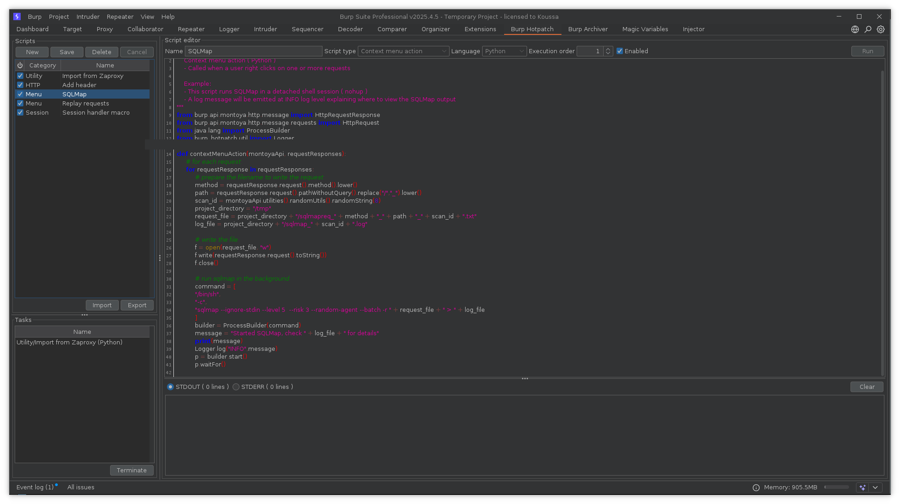

# Burp Hotpatch
Burp Hotpatch ️provides pentesters with a quick way to hook into key BurpSuite functions using user defined scripts.

# Use cases
- Session handling actions that require further processing after the session macro has run
- Writing payload processors for intruder
- Cases where Bambda expressions can't be used
- Proto-typing and testing
- Automation/integration with other tools

# How does it work?
Hotpatch implements handlers for `HttpHandler`, `ProxyRequestHandler`, `SessionHandlingAction` and `PayloadProcessor`.
When any of these actions happen the Hotpatch extension will execute any user scripts that apply.

# Script types
Users can create scripts that implement handlers for several BurpSuite functions as well as stand-alone scripts that can
be run interactively within BurpSuite. Below is a description of the various types of implementations available.

### Utility
- Stand-alone script that provides access to the Montoya API.
- Good for automation and repetitive actions.

### Http Handler ( `HttpHandler` )
- Called when a request is sent or received.

### Proxy handler ( `ProxyRequestHandler` )
- Called at various points during the proxy interception process.

### Session handling action ( `SessionHandlingAction` )
- Called after a session macro has completed.
- Very useful for handling cases where cookie based authentication is not used.

### Payload processor ( `PayloadProcessor` )
- Used for the creation of intruder payload processors.

# FAQ

#### Q: What language are scripts written in?
Scripts are written in Jython or JavaScript.

#### Q: What if I have multiple scripts that implement a certain functionality 
Your scripts run be run in sequence. For example, if you have several scripts that implement `ProxyRequestHandler` each
will be run one after another.

#### Q: What happens if an error occurs in one of my scripts that I can't debug interactively?
If an error or exception happens the script will be highlighted red in the scripts list and the STDERR will be available
for review. You can also print debugging information to the stdout.

#### Q: What API do the scripts use to interact with BurpSuite?
The extension uses the [Montoya API](https://portswigger.github.io/burp-extensions-montoya-api/javadoc/burp/api/montoya/MontoyaApi.html).

# Coming soon
- Update notifications ( not annoying - just a little link at bottom )
- Ordering of script execution if many apply
- Introspection / Montoya documentation tool tips 
- Interactive testing of scripts ( similar to BCheck editor test workflow ) 

# User interface
